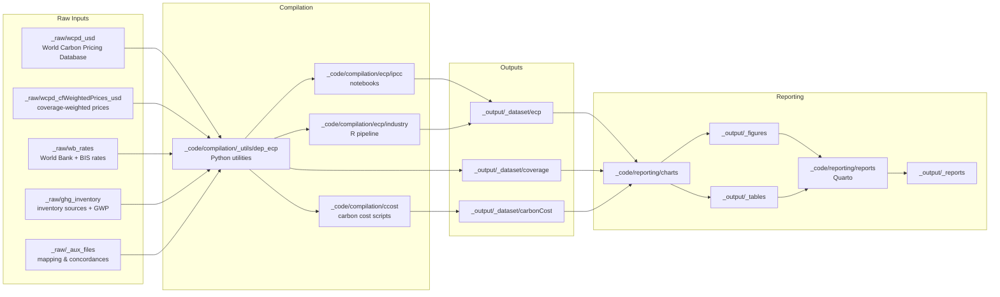

# Data pipeline

This repository builds the ECP dataset from raw pricing, emissions, and macroeconomic data, then produces figures and reports. The core flow is:

- Raw inputs live in `_raw`.
- Compilation scripts in `_code/compilation` harmonize prices, coverage, and emissions.
- Final datasets are written to `_output/_dataset`.
- Reporting scripts in `_code/reporting` generate charts and reports in `_output/_figures`, `_output/_tables`, and `_output/_reports`.

## Mermaid overview

## Compilation highlights

- `dep_ecp` in `_code/compilation/_utils` hosts shared Python utilities for coverage factors, currency conversion, inventory processing, and weighted averages.
- IPCC notebooks in `_code/compilation/ecp/ipcc` generate national and sector ECP calculations from harmonized inputs.
- Industry-level processing in `_code/compilation/ecp/industry` uses R scripts to import, match, and check sectoral concordances.

## Reporting highlights

- `generate_charts.py` orchestrates chart builds from the datasets in `_output/_dataset`.
- `report.qmd` assembles figures and tables into HTML/PDF deliverables via Quarto.
